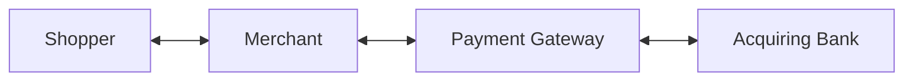

# Payment Gateway

***This documentation was last updated on 10/02/2025.***

An API gateway that will allow a merchant to offer a way for their shoppers to pay for their product. This service provides 2 payment endpoints to process a payment and retrive a previous payment.

**Processing a Payment**

